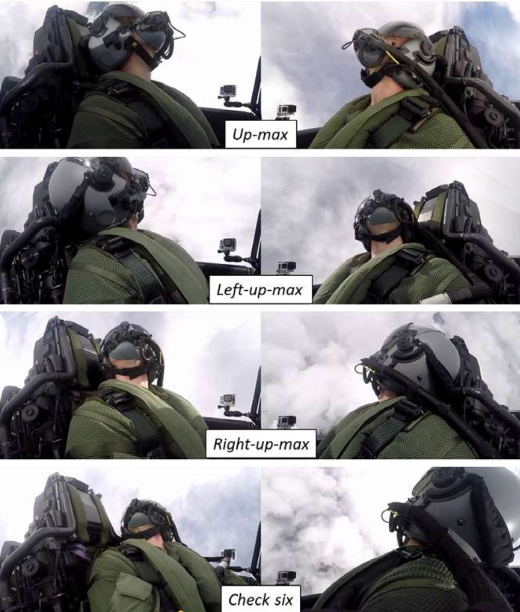
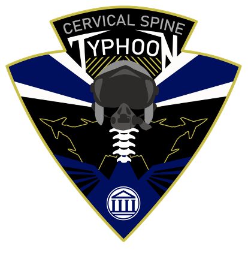
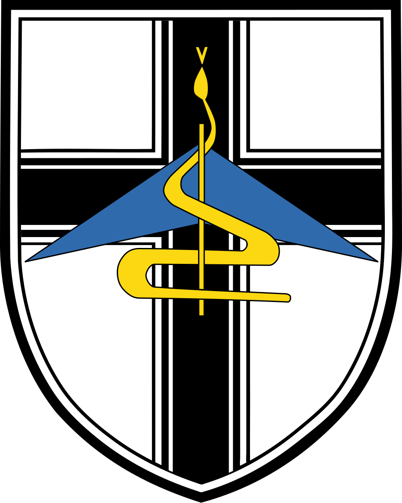

## Abstract
Military fast jet pilots face significant physical challenges, including high Gz accelerations during dynamic maneuvers. The objectives of this study were threefold: 1) to record pilot movements during real flights, 2) to quantify head and trunk movements under standardized Gz conditions and during basic fighter maneuvers (BFMs), and 3) to categorize compensatory strategies used to mitigate physical strain. 
 
A total of 20 Eurofighter pilots (mean age: 28.2 ± 1.4 yr, all men) with >500 h EF2000 flight experience participated in the study. Video footage collected during the execution of a standardized mission card, including predetermined head movements and jet parameters (5, 7, 9 Gz), and free basic fighter maneuvers were analyzed. 
 
During scripted high-Gz maneuvers, 38.5% of pilots prepositioned their head for the up-max movement at 9 Gz. During check six, coping strategies were applied in 35.7% (5 Gz), 30.8% (7 Gz), and 33.3% (9 Gz) of the flights. During basic fighter maneuvers, an average of 63.6 ± 32.1 head movements per session and 27.2 ± 13.7 per set were performed by the pilots. It was observed that end-range movements (e.g., check six) were associated with a greater usage of coping strategies. The most commonly included strategies were the use of support points such as canopy rails. 

{width=80% fig-align="center"}

 
This real-flight study reveals frequent use of anticipatory head positioning and compensatory strategies under high Gz loads, especially during end-range movements. These behaviors appear to serve the purpose of reducing cervical strain and injury risk. The findings underscore the necessity for targeted training and the optimization of ergonomic design in pilot equipment.

[<i class="bi bi-file-earmark-pdf-fill" style="color:orange;"></i> Download PDF](assets-posts/2025-Lingscheid-PhD3-AMHP.pdf){.btn .btn-primary target="_blank"}
[<i class="" style="color:orange;"></i> Download BibTeX](assets-posts/2025-Lingscheid-PhD3-AMHP.pdf){.btn .btn-primary target="_blank"}
[<i class="bi bi-file-earmark-ppt-fill" style="color:orange;"></i> Download Slides](assets-posts/2025-Lingscheid-PhD3-AMHP.pdf){.btn .btn-primary target="_blank"}

## Partner logos
{width=20% fig-align="center"}
{width=18% fig-align="center"}
{width=15% fig-align="center"}
{width=20% fig-align="center"}
{width=16% fig-align="center"}